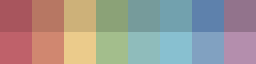

# arctica

Nord theme, but better.

Arctica seeks to be entirely aesthetically compatible with Nord, but to have a much better implementation, with colors added and dropped as needed.

## Why?
The Nord theme is ridiculously disorganized and the documentation is nonsensical. While the colors are great, it becomes a herculean effort to neatly integrate them into stuff.

### Highlighting Conflicts
For example, the [documentation states](https://www.nordtheme.com/docs/colors-and-palettes#nord2) that `nord2`, an "Even more brighter shade color of `nord0`" (Grammar 100) should be used both for highlighting text, *and* coloring the active line. The issue with this ridiculous approach is that the text selection becomes invisible on the currently selected line. This makes editing impossible. Strangely, this advice was actually implemented in the gedit theme, and probably a lot of other themes as well.

### The Forbidden Nord -1
On the [Nord theme website](https://nordtheme.com), you can experience a forbidden Nord color in the site background by clicking on the crescent moon to switch to dark mode. (What *is* a CSS media query, anyway?). The color is darker than `nord0`. Perhaps dark mode was deactivated by default on the site in an attempt to hide this intriguing color. I think it should be added as the 17th color and christened `nord -1`.

### Imbalanced Dark/Light Colors
On second thought, it shouldn't. Why? Well, it seems that in an effort to keep the palette 16 colors long, Arctic Ice Studios had to include 4 dark colors, and only 3 light colors. This is bizarre, because when reading through the documentation, it seems as if they intended Polar Night and Snowstorm to  be equivalents of eachother, to be used for dark mode and light mode respectively. Unfortunately, since the colors are imbalanced 4:3 (5:3 if you count `nord -1`) they're not exactly hot swappable.

### The Nord Theme Blues
What they couldn't do for the white colors, Arctic Ice Studios certainly made up for in the blues! [Frost](https://www.nordtheme.com/docs/colors-and-palettes#frost), the "heart palette of Nord", is composed of *four* slightly different shades of blue. While they are all clearly distinct colors, an extra Snow Storm color could definitely have taken the place of one.

### What About Terminals?
This issue is rather simple. Terminals want 16 colors, only 4 of those being gray/white/black shades. Nord does not have dark versions of the aurora colors, thus not enough colors to theme a terminal.

### Conclusion
This is nothing short of tragic, because Nord is probably one of the most aesthetically pleasing color palettes in existence.

Thus, this project.

# Documentation on the Colors

## Polar Night

`0    1    2    3`

A implementation of the original Polar Night colors, this time starting in a deeper key. Designed to be entirely equivalent to Arctica's own Snow Storm.

In dark themes, these colors are usually used as backgrounds. In light themes, they are used as text/icon colors.

### Arctica 0
`2b303c`

Background, equivalent to Arctica 4.

#### Dark themes
* As a background
* As a terminal background
* As a shadow
* Rarely, to break up lighter Polar Night colors

#### Light themes
* Do not use this color in light themes

### Arctica 1
`2e3440`

Secondary background, equivalent to Arctica 5, except when used as black in a terminal.

#### Dark themes
* As a secondary background
* To break up lighter Polar Night colors

#### Light themes
* As text, icons, etc
* As the default foreground color in a terminal

### Arctica 2
`3b4252`

Lifted background, equivalent to Arctica 6.

#### Dark themes
* For lifted elements, such as popups, some buttons/inputs, etc
* For highlighting the current line
* For comments

#### Light themes
* Can be used for text, icons, etc with less prominence, but it is recommended that Arctica 3 be used for this purpose

### Arctica 3
`4c566a`

Highlight, equivalent to Arctica 7, except when used as dark gray in a terminal.

#### Dark themes
* For text highlighting/selecting
* To denote selection in general

#### Light themes
* Text, icons, etc with less prominence

## Snow Storm

`4    5    6    7`

A implementation of the original Snow Storm colors Designed to be entirely equivalent to Arctica's own Polar Night. Unlike Polar Night, these colors are ordered from dark to light. This is intentional - all you need to do to turn on the lights is add 4.

In light themes, these colors are usually used as backgrounds. In dark themes, they are used as text/icon colors.

### Arctica 4
`eceff4`

Background, equivalent to Arctica 0.

#### Light themes
* As a background
* As a terminal background
* As a shadow
* Rarely, to break up darker Snow Storm colors

#### Dark themes
* Do not use this color in dark themes

### Arctica 5
`d8dee9`

Secondary background, equivalent to Arctica 1, except when used as white in a terminal.

#### Light themes
* As a secondary background
* To break up darker Snow Storm colors

#### Dark themes
* As text, icons, etc
* As the default foreground color in a terminal

### Arctica 6
`c2c9d6`

Lifted background, equivalent to Arctica 2.

#### Light themes
* For lifted elements, such as popups, some buttons/inputs, etc
* For highlighting the current line
* For comments

#### Dark themes
* Can be used for text, icons, etc with less prominence, but it is recommended that Arctica 7 be used for this purpose

### Arctica 7
`aeb7c6`

Highlight, equivalent to Arctica 3, except when used as light grey in a terminal.

#### Light themes
* For text highlighting/selecting
* To denote selection in general

#### Dark themes
* Text, icons, etc with less prominence

## Aurora
`8    9   10   11   12   13   14   15`

`16   17   18   19   20   21   22   23`

Aurora and Frost have been melded into one section. Each of these colors has a handy dark and light version.

### Arctica 8 and 16
`a8555d`|`bf616a`

Represents a process which has failed, an error, or potentially risky functionality, such as a "discard changes and exit" button.

Should highlight git diff deletions and erroneous syntax/code.

### Arctica 9 and 17
`b77763`|`d08770`

Rarely used in UI.

Should highlight special syntax and escape characters/sequences.

### Arctica 10 and 18
`cdb179`|`ebcb8b`

Represents a process that has succeeded with warnings, or warnings in general.

Should highlight git diff modifications and regular expressions.

### Arctica 11 and 19
`8ba277`|`a3be8c`

Represents a process which has succeeded.

Should be used to highlight strings and chars, as well as git diff additions.

### Arctica 12 and 20
`769b9b`|`8fbcbb`

Should highlight classes, datatypes, and primitives.

### Arctica 13 and 21
`72a1ae`|`88c0d0`

This is the palette's primary accent color. It should be used for UI elements that need to be more visually prominent, such as a default OK button.

Should highlight declarations, functions, and function calls.

### Arctica 14 and 22
`5e81ac`|`81a1c1`

These are secondary and tertiary accent colors, respectively. They should be used foe elements that need to be visually prominent, but not as much as elements colored with Arctica 21.

Arctica 14 should highlight reserved keywords, operators, tags, units, and punctuation.

Arctica 22 should highlight pre-processor directives.

### Arctica 15 and 23
`92738c`|`b48ead`

Rarely used in UI.

Should highlight numbers, such as integers or floats.

## Important notes

### Text highlighting
The foreground color of selected text should change to the default foreground color.

### Aurora Color Shades
Descriptions of syntax highlighting and UI elements refer to the lighter Aurora colors, unless otherwise noted.
